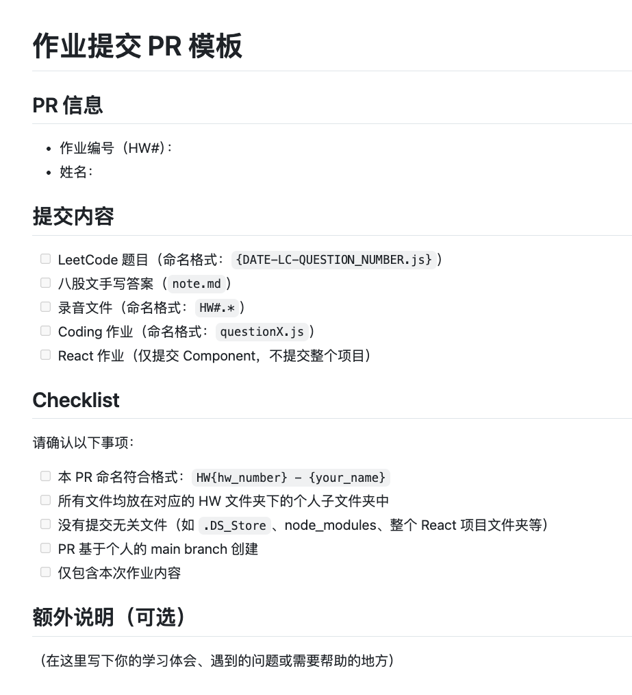

# HW1 - Mock Interview 

## 1. What is HTML?
HTML stands for hypertext markup language. It is used to define the structure of a webpage. It is the skeleton of the
webpage that it organizes the visible contents like heading or paragraphs. But it does not responsible for the styling 
and logic. 

---

## 2. What is the purpose of the <meta> tag?
<meta> tags provide metadata about the webpage, it is not for users. User cannot see it. But browsers, search engine or
devices will use the information in the <meta> tag to interpret and configure the webpage. Common use cases include 
defining character encoding and viewport settings.

---

## 3. What is the minimal structure of an HTML5 document?
There are at least four parts. Doctype html, html, head and body. Head is for metadata, and body is for visible content.

---

## 4. What is the difference between <head> and <header> ?
<head> holds metadata used by browsers or search engine. It is inside the <meta> tag, and not visible to the users.
But <header> holds visible content, it is inside the <body> tag. It usually used to hold the title of a page or a section. 

---

## 5. What element can we use to create a dropdown list?
I typically use select tag with option tag. I normally use it for categories or choice selection.

---

## 6.  What is the <form> tag used for?
the form tag used to collect the user input data and submit data to server. It defines where user can enter data, and
then the data will be submitted by using Get or Post.

---

## 7. Explain the rel="noreferrer nofollow" attribute in <a> tag? How can we open the link in a new tab?
<a> tag creates a hyperlink. the rel means the relationship with this link. When it says nofollow, that means I do not 
endorsing the link,and not passing any ranking values. So it is for SEO. The noreferrer is for privacy, it means it does 
not pass any referrer's information. To open the link in a new tab, you just need to set the target equals to dash blank.

---

## 8. How do you serve your page in multiple languages?
Usually lang attribute is used to define the language used to display the page content. If consider the SEO, you can 
assign a language specific URL to each language at the link. So the webpage will jumps to that link after search engine 
detects the primary language of the user. In real world, you actually may need to deal with the page translation or locale
detection at framework or app level. 

---

## 9. What are semantic HTML tags, and why are they important?
Semantic HTML describe the meaning of the content, like header, nav, or footer. It is important for 
accessibility, it makes the code easier to understand, and it helps SEO so the search engine can better interpret it. 

---

## 10. Whatʼs the difference between SVG and Canvas?
SVG is a part of DOM, and it is vector-based. so it scales image without losing quality. Canvas is pixel-based, 
so scaling can cause image bury. But if you cares about the performance, you can choose Canvas. 

---

# W3School HTML Quiz Screenshot

