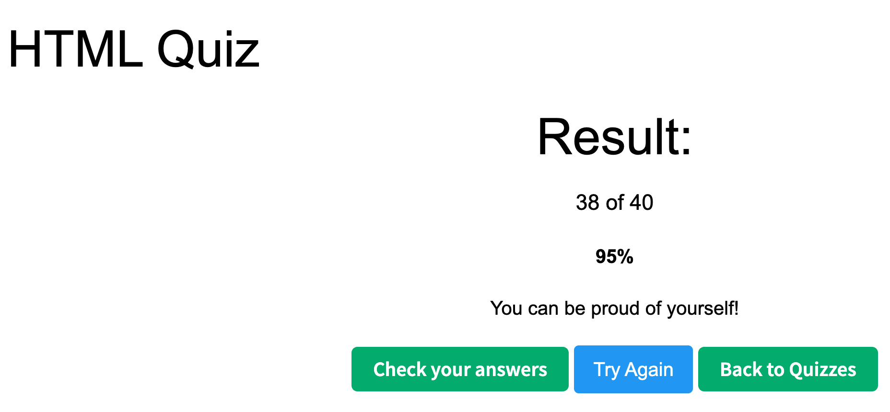

1. What is HTML?
    HTML is the standard markup language used to structure content on the web, such as text, images, links, forms, and layout.
    
2. What is the minimal structure of an HTML5 document?
    ```<!DOCTYPE html>
        <html lang="en">
            <head>
                <meta charset="UTF-8">
                <title>Document</title>
            </head>
            <body>
            </body>
        </html>
    ```
3. What is the purpose of the meta tag?
   - It provides metadata about the document, such as character encoding, viewport settings, SEO info, and browser behavior.

4. What is the difference between `<head>` and `<header>` ?
   - <head> holds metadata and resources and is not visible.
   - <header> is a semantic tag used for visible page headers like logos, titles, and navigation.
  
5. What is the <form> tag used for in HTML?
   - It is used to collect user input and send data to the server for processing.
  
6. Explain the following code
    
    ```html
    <a href="http://example.com/sample_page/" rel="noreferrer nofollow">Link</a>
    ```
    - It creates a link.
    - noreferrer prevents sending referrer information.
    - nofollow tells search engines not to pass SEO value to the target.
    
7. How do you serve your page in multiple languages?
    - Use different URLs or routes like /en, /fr, use the lang attribute, and load translated content using i18n libraries or server-side localization.
  
8. What are semantic HTML tags and why are they important?
    - Semantic tags like <header>, <nav>, <main>, <article>, and <footer> describe the meaning of content.
    - They improve accessibility, SEO, and code readability.


