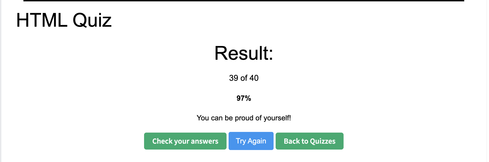

# HTML Interview Notes

## 1. What is HTML?
HTML is short for **HyperText Markup Language**.  
It is the standard markup language used to create web pages.

---

## 2. What is the purpose of the `<meta>` tag?
The purpose of the `<meta>` tag is to provide metadata about an HTML document, such as character encoding, page description, and viewport settings, for browsers and search engines.

---

## 3. What is the minimal structure of an HTML5 document?
The minimal structure of an HTML5 document includes the doctype declaration (`<!DOCTYPE html>`), the `<html>` element, and the `<head>` and `<body>` sections.

---

## 4. What is the difference between `<head>` and `<header>`?
The `<head>` element is used to store metadata for the document and is not displayed on the page.  
The `<header>` element is used for the top content of a page or section and is displayed to users.

---

## 5. What element can we use to create a dropdown list?
We use the `<select>` element to create a dropdown list, with `<option>` elements inside it.

---

## 6. What is the `<form>` tag used for in HTML?
The `<form>` tag is used to collect user input and submit it to a server for processing.

---

## 7. Explain the `rel="noreferrer nofollow"` attribute in `<a>` tag.  
How can we open the link in a new tab?

- `rel="noreferrer"` prevents the browser from sending referrer information to the target site.
- `rel="nofollow"` tells search engines not to follow the link or pass SEO value to the linked page.
- To open the link in a new tab, use: `target="_blank"`

---

## 8. How do you serve your page in multiple languages?
I set the correct `lang` attribute, and use `hreflang` to mark language versions.

---

## 9. What are semantic HTML tags, and why are they important?
Semantic HTML tags are HTML tags whose names clearly describe the meaning of the content and the page structure.  
They are important because they improve code readability, SEO, accessibility, and maintainability.

---

## 10. What’s the difference between SVG and Canvas?
SVG is resolution-independent and interactive; Canvas is bitmap-based and optimized for performance.

