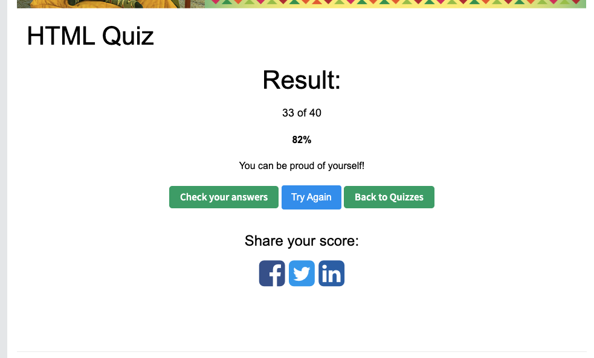

# HTML Questions and Answers

## 1. What is HTML?

HTML stands for HyperText Markup Language. It is the standard language used to create and structure content on the web, such as text, images, links, and forms. For example google chrome read HTML to display web pages.

## 2. What is the minimal structure of an HTML5 document?

The minimal structure of an HTML5 document includes document declaration, some html element, head section, and a body section and the head contains metadata, and body contains the visible content of the page.

## 3. What is the purpose of the meta tag?

The meta tag is used to provide the metadata about HTML document, such as character encoding(UFT-8), viewpoint settings, page description, and author information. Those data would be use by the browser engine.

## 4. What is the difference between `<head>` and `<header>`?

The `<head>` tag contains metadata about the document, such as the title, styles, and scripts, and it is not visible on the page.

The `<header>` tag is a semantic element that represents introductory content, such as a logo or navigation, and it is visible to users.

## 5. What is the `<title>` tag used for in HTML?

The `<title>` tag defines the tile of the web page. It appears in the browser tab and is also used by search engines as the page title in search results.

## 6. Explain the following code

\`\`\`html
<a href="http://example.com/sample_page/" rel="noreferrer nofollow">Link</a>
\`\`\`

This code creates a hyperlink to another web page. The href attribute specifies the destination URL. The rel="noreferrer nofollow" attribute tells the browser not to send referrer information and tells search engines not to follow the link for ranking purposes.

## 7. How do you serve your page in multiple languages?

We can define the html's language attribute to the specific language. Or we can use hreflang links.

## 8. What are semantic HTML tags and why are they important?

Semantic HTML tags clearly describe the meaning of their content, such as `<header>`, `<nav>`, `<main>`, `<section>`, and `<footer>`. They are important because they improve accessibility, search engine optimization, and code readability.

## 9. W3School HTML Quiz

