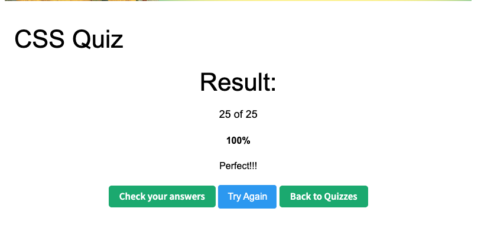

# Mock Interview - CSS

## 1. What is CSS?
    CSS stands for Cascading Style Sheets. It is used to style a web page. It controls things
    like colors, fonts, spacing, and layout using flexbox or grid. I usually think of HTML as the skeleton of a dog, 
    and CSS as everything visual — like the fur color, eye style, or even how long the tail is.

##  What is block element? How is it different from inline, and inline-block elements?
    Block elements start on a new line and take the full width of their parent by default, so they stack vertically. 
    Inline elements stay on the same line and flow horizontally with the text, and their width is based on the content.
    Inline-block is kind of a mix — it stays inline, but you can set width and height.

##  What is the difference between pseudo-class and pseudo-element?
    Pseudo-classes focus on the state of an element or how users interact with it. For example, when you hover over a 
    button, its state changes and the color can change. Pseudo-elements focus on styling a specific part of an element’s 
    structure, like using ::first-letter to change the color of only the first letter of a word.
    
##  What is the difference between the child combinator and the descendant combinator?
    The child combinator selects only the direct children, while the descendant combinator selects all nested elements 
    inside. I usually use the child combinator when I want more control and don’t want styles to leak when the DOM 
    structure changes.

##  What is the attribute selector? Give some examples.
    An attribute selector allow you to select and style elements based on the attribute or attribute value.
    For example, when you use input tag, you can set style=text for name, style=number for age, or style =radio for single 
    selection. It’s useful when you don’t want to add extra classes or when working with third-party markup.

##  What are two ways that we can make an element invisible? What is the difference?
    One way is to set display: none, which completely removes the element from the layout.
    Another way is to set visibility: hidden, which keeps the space but hides the element from the user.
    Additionaly, you can also set opacity: 0 if you still need the element to stay in the layout or support interaction.

##  What is the CSS Box Model? Describe each part.
    The CSS box model defines how the element finally display on the webpage, based on the size and spacing. There are 
    four parts layered from inside out: conten, padding, border and marging. 
    -When you think of it like the visual elemets is like an item put in a delivery box, Content is the item that users 
    see on the webpage.
    -Padding is the the space between the content and the box, it is like if you want to put the stuff in a smaller box, 
    or in a larger box which has more space? 
    -Border will be how thick the delivery box is, and marging is the space bewteen each delivery box. You want each 
    content stack together or you want to put them a little away from each other?

##  What is the usage of !important? What are some use cases? 
    bang important is used to force a CSS rule to override other existing styles, basically giving it the highest priority,
    and ignore the original rule.
    However, it’s usually not recommended because it breaks the normal cascade and can make styles harder to debug and maintain.
    But it is a good one to use in some cases, you can either use it when you want to make sure a utility calss always work, 
    or use it to override the thirf-party plug in styling. Or you can use it to debug when a styling does not show up as you wanted.

##  What does z-index do?
    It controls which element appears on top of others. It gives each content a stacking value. A higher z-index value will
    sit on top of the one with lower z-index value. But z-index only works with content that has position property other than
    static, like absolute, relative, fixed, or sticky. For example, a dropdown menu. If you have a main category and a 
    second menu pops out, you want that second list to have a high z-index so it stays on top of the page content and 
    doesn't get hidden behind an image or a video below it.

##  Can padding and margin be negative?
    Margin can be negative, padding cannot. Negative margins can pull elements closer or overlap them. But padding 
    always adds space inside the element, so it can’t be negative.
##  How do you center a block element with CSS?
    Use margin: auto when the width is defined. But the most common way I do it now is using Flexbox on the parent, I
    just set display: flex and justify-content: center.

##  What are grid items? Can you explain some grid item properties?
    Grid items are the direct children of a grid container.
    I like to think of CSS Grid as a bookshelf. The grid container is the bookshelf itself, and grid items are the things 
    placed into each shelf slot.
    Common grid item properties include grid-column and grid-row, which control where an item is placed and how much 
    space it spans. For example, if I set grid-column: 2 and grid-row: 1, the item starts at column 2, row 1. If I set 
    grid-column: span 2, the item spans two column slots.
    Properties like justify-self and align-self control how a grid item is aligned inside its grid cell.
    For example, justify-self: center centers the item horizontally within the cell, while align-self controls vertical
    alignment.

##  What is a flex container? Can you explain some flex container properties?
    A flex container is an element where you set display: flex, and all its direct children become flex items. It helps
    the layout adjust to different screen size.
    I like to think of Flexbox as a stretchy conveyor belt.
    The belt can stretch or shrink to fit the container, and the items automatically adjust their spacing and alignment.
    The belt direction is controlled by flex-direction, which decides whether items are laid out in a row or a column.
    How items are spaced along the belt is controlled by justify-content, and how items are aligned across the belt is 
    controlled by align-items.

##  What is responsive web design? How do we achieve this?
    Basically, it’s the practice of making sure a website looks good and works great on any device, or any type or size of
    the screen, like it can either adapt to a large minitor screem or a small phone screen. We usually use Fulid grid, 
    flex media or media queries for this purpose. 
    For example, if you want to design a webpage that is mobile-friendly, you may start with simple CSS for small screen, 
    and then use media quires to add complexity as the screen gets bigger.

# Quiz - CSS

