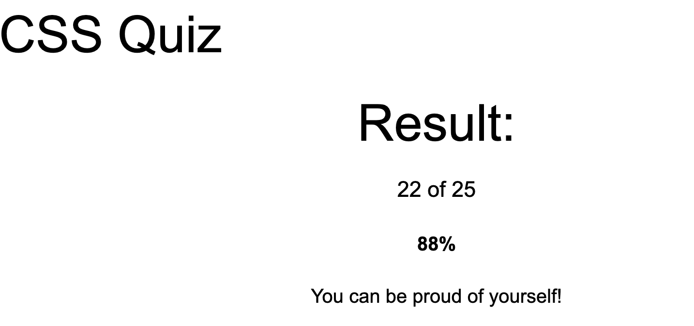

1. What is CSS?
   - CSS (Cascading Style Sheets) is used to control the presentation of HTML elements. It defines layout, colors, fonts, spacing, positioning, and responsiveness, separating content from design.
  
2. How do you link a CSS file to an HTML document?
   - Inside the <head> tag:
   - ``` <link rel="stylesheet" href="styles.css"> ```
  
3. What is block element? How is it different from inline, and inline-block elements?
   - Block elements take the full width available. Inline elements only take the space they need.Inline-block behaves like inline but supports width/height.
  
4. What is the difference between pseudo-class and pseudo-element?
   - Pseudo-class: targets a state of an element. Example: a:hover, input:focus
   - Pseudo-element: targets a part of an element. Example: p::first-letter, div::before
  
5. What is the difference between the child combinator and the descendant combinator?
   - Descendant: selects all nested children ```div p```
   - Child: selects only direct children ```div > p```
  
6. What are two ways that we can make an element invisible? What is the difference?
   - display: none; visibility: hidden;
   -  | Property           | Space Taken? | In DOM? |
      | ------------------ | ------------ | ------- |
      | display: none      | No           | No      |
      | visibility: hidden | Yes          | Yes     |

7. What is the Box Model? Describe each part.
   - It consists of: Margin → Border → Padding → Content

8. What is the usage of !important? What are some use cases?
   - Overrides all other CSS rules regardless of specificity.
   - Use cases: Overriding third-party CSS, Temporary debugging
   - Avoid in maintainable code due to poor scalability.
 - 
9.  What does z-index do?
   - Controls vertical stacking order of positioned elements.
   - Higher z-index appears in front.
   - Requires position: relative | absolute | fixed | sticky.
  
10. Can padding and margin be negative?
   - Margin: Yes
   - Padding: No
  
11. How do you center a block element with CSS?
   ```div {
         margin: 0 auto;
      } ```

12. What are grid items? Can you explain some grid item properties?
   - Grid items are direct children of a grid container.
   - grid-column, grid-row, grid-area, justify-self, align-self

13. What is a flex container? Can you explain some flex container properties?
   - A flex container is an element with: display: flex;
   - flex-direction, justify-content, align-items, flex-wrap, gap

14. Assume a parent element has *width = 200px* and one child element*.* If the child element’s width is set to ‘auto’, what are the values of its width, left-margin, & right-margin?
   - Result: width = 200px; margin-left = 0; margin-right = 0
   - Child expands to fill available space.

15. Can you explain the difference between px, em and rem as they relate to font sizing?
   -  | Unit | Relative To             |
      | ---- | ----------------------- |
      | px   | Fixed unit              |
      | em   | Parent font size        |
      | rem  | Root (`html`) font size |
   - Use rem for scalable and predictable layouts.

16. What is responsive web design? How do we achieve this?
   - Responsive Web Design ensures that a website adapts to different screen sizes and devices.
   - Achieved by: Media queries, Flexible layouts (Flexbox, Grid), Relative units (%, rem, vw, vh), Responsive images, Mobile-first design
   - ```@media (max-width: 768px) {
            body {
               font-size: 14px;
            }
            }```


