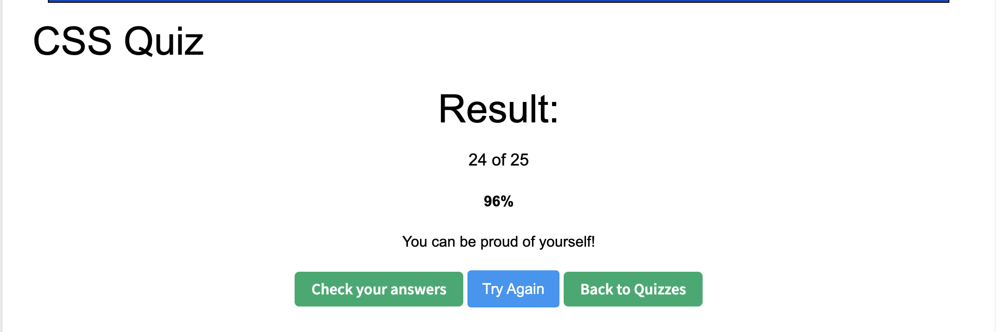

# CSS Interview Notes

## 1. What is CSS?
CSS is stand for Cascading Style Sheets. It is the language used to style an HTML document.
It describes how HTML elements should be displayed.

## 2. What is a block element? How is it different from inline and inline-block elements?

### Block elements
- Take up the full width available
- Start on a new line
- You can set width, height, margin, and padding

### Inline elements
- Do not start a new line
- Only take up content width
- Width and height cannot be set

### Inline-block elements
- Stay on the same line like inline
- Allow width and height like block

## 3. What is the difference between pseudo-class and pseudo-element?
Pseudo-class selects an element in a specific state.
Pseudo-element selects a specific part of an element or creates a virtual element.

## 4. What is the difference between the child combinator and the descendant combinator?
Child combinator selects only direct children of an element.
Descendant combinator selects all nested elements, no matter how deep.

## 5. What is the attribute selector? Give some examples.
Attribute selectors target elements based on attributes.

- Selects elements whose attribute exactly equals a value  
- Selects elements whose attribute value starts with a prefix  
- Selects elements whose attribute value ends with a suffix  
- Selects elements whose attribute value contains a substring  
- Selects elements whose attribute is exactly a word or contains that word

## 6. What are two ways that we can make an element invisible? What is the difference?
display: none
- The element is removed from the layout
- It takes up no space

visibility: hidden
- The element is hidden but still takes up space
- The layout does not change

## 7. What is the CSS Box Model? Describe each part.
The CSS Box Model describes how the size and spacing of an element are calculated.

Parts(from inside to outside):
1. Content – The actual content
2. Padding – Space between content and border
3. Border – Surrounds padding and content
4. Margin – Space outside the border

## 8. What is the usage of !important? What are some use cases?
!important forces a CSS rule to override all other conflicting rules.

Common use cases:
- Overriding third-party library styles
- Quick fixes or debugging
- Legacy codebases

## 9. What does z-index do?
z-index controls the stacking order of overlapping elements. Higher values appear on top.

## 10. Can padding and margin be negative?
Margin can be negative.It pulls elements closer together or causes them to overlap.

Padding cannot be negative.Negative padding is invalid in CSS and will be ignored by the browser.

## 11. How do you center a block element with CSS?
Set a width and use auto margins:

## 12. What are grid items? Can you explain some grid item properties?
Grid items are the direct children of a CSS Grid container.

properties:
grid-column
grid-row
grid-column-start / grid-column-end
grid-row-start / grid-row-end
justify-self
align-self

## 13. What is a flex container? Can you explain some flex container properties?
A flex container is an element with `display: flex` or `display: inline-flex`.

- **flex-direction**: Defines the main axis direction  
- **flex-wrap**: Controls whether items wrap to the next line  
- **justify-content**: Aligns items along the main axis  
- **align-items**: Aligns items along the cross axis  
- **align-content**: Aligns multiple rows when items wrap  
- **gap**: Sets spacing between flex items

## 14. What is responsive web design? How do we achieve this?

Responsive web design adapts websites to different screen sizes.

How we achieve it:
1. Flexible layouts 
2. Media queries
3. Responsive units
4. Responsive images 
5. Mobile-first design

